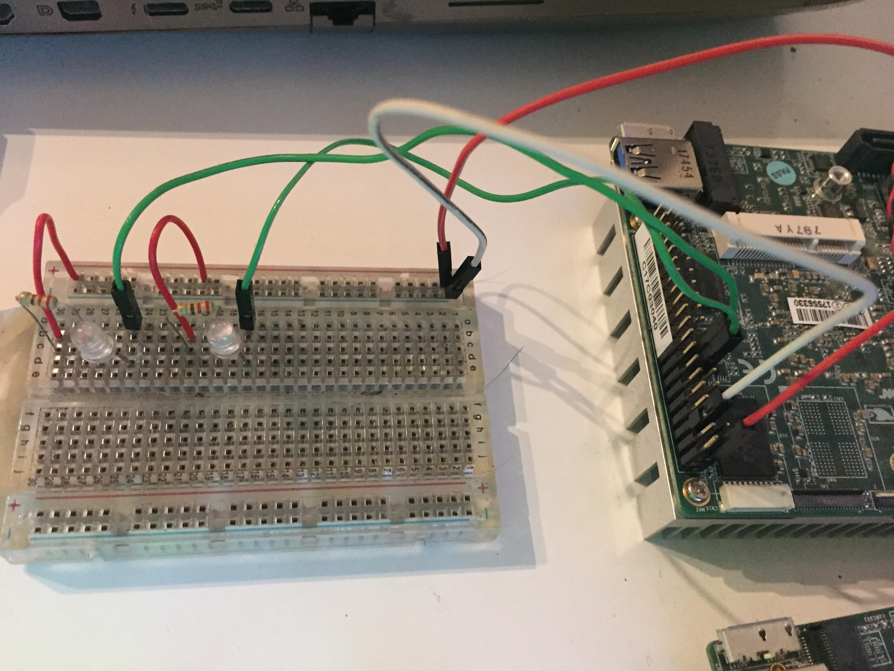
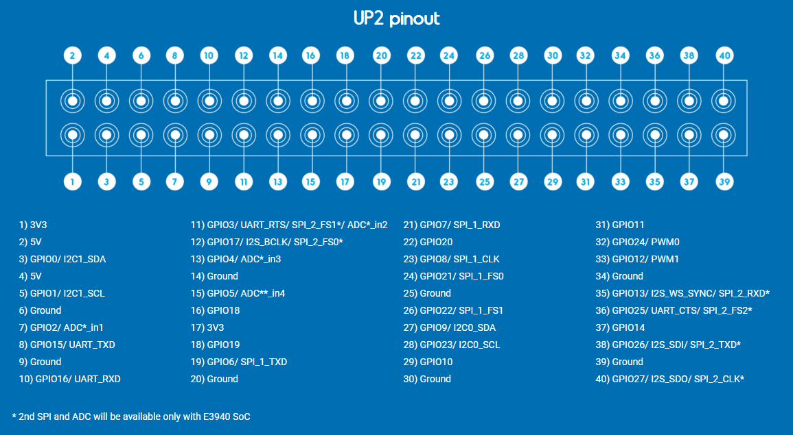

# Peter Moss COVID-19 AI Research Project
## EMAR Mini Emergency Assistance Robot
[](https://github.com/COVID-19-Research-Project/EMAR-Mini)

&nbsp;

# Table Of Contents

- [Introduction](#introduction)
- [Required Hardware](#required-hardware)
- [Prerequisites](#prerequisites)
    - [HAIS Server](#hias-server)
    - [Device 1 & 2 Installation Guides](#device-1-2-installation-guides)
    - [Ubuntu Server 18.04.4 LTS](#prerequisites)
    - [Ubuntu kernel 4.15.0 for UP](#prerequisites)
    - [Clone the repository](#clone-the-repository)
        - [Developer Forks](#developer-forks)
- [Installation](#installation)
  - [Update Device Settings](#update-device-settings)
  - [Device Security](#device-security)
    - [Remote User](#remote-user)
    - [SSH Access](#ssh-access)
    - [UFW Firewall](#ufw-firewall)
    - [Fail2Ban](#fail2ban)
  - [Python Dependencies](#python-dependencies)
  - [MRAA](#mraa)
  - [Jumper Wires](#jumper-wires)
  - [Breadboard](#jumper-wires)
    - [UP2 Pinout](#up2-pinout)
    - [RPI GP-Bus Layout](#rpi-gp-bus-layout)
    - [LEDs](#leds)
  - [Intel Realsense D415](#intel-realsense-d415)
  - [Neural Compute Stick 2/OpenVINO](#neural-compute-stick-2-openvino)
- [Start The System](#start-the-system)
- [Contributing](#contributing)
    - [Contributors](#contributors)
- [Versioning](#versioning)
- [License](#license)
- [Bugs/Issues](#bugs-issues)

&nbsp;

# Introduction
The following guide will take you through setting up and installing the  [EMAR Mini Emergency Assistance Robot](https://github.com/COVID-19-Research-Project/EMAR-Mini "EMAR Mini Emergency Assistance Robot") device 3 of 3. 

Device 3 homes the software for the near-realtime object detection and depth sensing for measuring distances. 

&nbsp;

# Required Hardware


- 1 x UP2
- 1 x Intel Realsense D415 Depth Camera
- 1 x Breadboard
- 2 x LED's
- 2 x 220 Ω resistors
- Jumper wires

&nbsp;

# Prerequisites  

## HIAS Sever
This system requires a fully functioning [HIAS server](https://github.com/LeukemiaAiResearch/HIAS "HIAS server"). Follow the [HIAS server installation guide](https://github.com/LeukemiaAiResearch/HIAS/blob/master/Documentation/Installation/Installation.md "HIAS server installation guide") to setup your HIAS server before continuing with this tutorial.

## Device 1 & 2 Installation Guides
Before you continue with this tutorial, you should complete the steps in the [Device 1 installation guide](Devices/1/Documentation/Installation/Installation.md "Device 1 installation guide") and the [Device 2 installation guide](Devices/2/Documentation/Installation/Installation.md "Device 2 installation guide").

## Ubuntu Server 18.04.4 LTS
For this project, the operating system of choice is [Ubuntu Server 18.04.4 LTS](https://ubuntu.com/download/server "Ubuntu Server 18.04.4 LTS"). To get your operating system installed you can follow the [Create a bootable USB stick on Ubuntu](https://tutorials.ubuntu.com/tutorial/tutorial-create-a-usb-stick-on-ubuntu#0 "Create a bootable USB stick on Ubuntu") tutorial. 

**__!! The server installation REQUIRES a fresh installation, do not do this on an existing system, if you make a mistake you will have to reinstall and will lose all of the contents of your device !!__**

## Ubuntu kernel 4.15.0 for UP
To be able to interact with the pins of the UP2 you need to install the UP kernel. When it asks you if you want to abort, you need to choose **no** and continue the installation.

```
sudo add-apt-repository ppa:ubilinux/up
sudo apt update
sudo apt-get autoremove --purge 'linux-.*generic'
sudo apt-get install linux-image-generic-hwe-18.04-upboard
sudo apt dist-upgrade -y
sudo reboot
```

## Clone the repository
Clone the [EMAR](https://github.com/COVID-19-Research-Project/EMAR-Mini "EMAR") repository from the [Peter Moss COVID-19 AI Research](https://github.com/COVID-19-AI-Research-Project "Peter Moss COVID-19 AI Research") Github Organization.

To clone the repository and install EMAR-Mini, make sure you have Git installed. Now to the home directory on your server device using terminal/commandline, and then use the following command.

```
git clone https://github.com/COVID-19-Research-Project/EMAR-Mini.git
```

Once you have used the command above you will see a directory called **EMAR-Mini** in your home directory. 
```
ls
```
Using the ls command in your home directory should show you the following.
```
EMAR-Mini
```
Navigate to **EMAR-Mini/Devices/3** directory, this is your project root directory for this tutorial.

### Developer Forks
Developers from the Github community that would like to contribute to the development of this project should first create a fork, and clone that repository. For detailed information please view the [CONTRIBUTING](../../../../CONTRIBUTING.md "CONTRIBUTING") guide. You should pull the latest code from the development branch.

```
  $ git clone -b "0.4.0" https://github.com/COVID-19-Research-Project/EMAR-Mini.git
```

The **-b "0.4.0"** parameter ensures you get the code from the latest master branch. Before using the below command please check our latest master branch in the button at the top of the project README.

&nbsp;

# Installation
Now you need to install the EMAR system and it's dependencies.

## Update Device Settings

Now you need to update the device 2 settings using the credentials provided in the HIAS UI. 

```
sudo nano Device/2/confs.json
```
```
{
    "iotJumpWay": {
        "host": "YourHiasServerURL",
        "port": 8883,
        "ip": "localhost",
        "lid": 0,
        "zid": 0,
        "did": 0,
        "dn": "YourEmarDevice2Name",
        "un": "YourEmarDevice2Username",
        "pw": "YourEmarDevice2Password"
    },
    "EMAR": {
        "ip": "YourEmarDevice2LocalIP"
    },
    "Realsense": {
        "server": {
            "port": 8282
        },
        "socket": {
            "port": 8383
        }
    }
}
```

## Device Security
First you will harden your device security. 

### Remote User
You will create a new user for accessing your server remotely. Use the following commands to set up a new user for your machine. Follow the instructions provided and make sure you use a secure password.
```
sudo adduser YourUsername 
```
Now grant sudo priveleges to the user:
```
usermod -aG sudo YourUsername
```
Now open a new terminal and login to your server using the new credentials you set up.
```
ssh YourNewUser@YourServerIP
```

### SSH Access
Now let's beef up server secuirty. Use the following command to set up your public and private keys. Make sure you carry out this step on your development machine, **not** on your server.

#### Tips
- Hit enter to confirm the default file. 
- Hit enter twice to skip the password (Optionalm, you can use a password if you like).
```
ssh-keygen
```
You should end up with a screen like this:
```
Generating public/private rsa key pair.
Enter file in which to save the key (/home/genisys/.ssh/id_rsa): 
Enter passphrase (empty for no passphrase): 
Enter same passphrase again: 
Your identification has been saved in /home/genisys/.ssh/id_rsa.
Your public key has been saved in /home/genisys/.ssh/id_rsa.pub.
The key fingerprint is:
SHA256:5BYJMomxATmanduT3/d1CPKaFm+pGEIqpJJ5Z3zXCPM genisys@genisyslprt
The key's randomart image is:
+---[RSA 2048]----+
|.oooo..          |
|o .o.o . .       |
|.+..    +        |
|o o    o .       |
|  .o .+ S . .    |
| =..+o = o.o . . |
|= o =oo.E .o..o .|
|.. + ..o.ooo+. . |
|        .o++.    |
+----[SHA256]-----+
```
Now you are going to copy your key to the server: 
```
ssh-copy-id YourNewUser@YourServerIP
```
Once you enter your password for the new user account, your key will be saved on the server. Now try and login to the server again in a new terminal, you should log straight in without having to enter a password.
```
ssh YourNewUser@YourServerIP
```
Finally you will turn off password authentication for login. Use the following command to edit the ssh configuration.
```
sudo nano /etc/ssh/sshd_config
```
Change the following:
```
#PasswordAuthentication yes
```
To:
```
PasswordAuthentication no
```
Then restart ssh:
```
sudo systemctl restart ssh
```
_If you are using ssh to do the above steps keep your current terminal connected._ Open a new terminal, attempt to login to your server. If you can login then the above steps were successful. 

The remainder of this tutorial assumes you are logged into your device. From your development machine, connect to your device using ssh or open your local terminal if working directly on the machine.

```
ssh YourUser@YourServerIP
```
### UFW Firewall
Now you will set up your firewall:

```
sudo ufw enable
sudo ufw disable
```
Now open the required ports, these ports will be open on your server, but are not open to the outside world:
```
sudo ufw allow 22
sudo ufw allow OpenSSH
```
Finally start and check the status:
```
sudo ufw enable
sudo ufw status
```
You should see the following:
```
Status: active

To                         Action      From
--                         ------      ----
OpenSSH                    ALLOW       Anywhere
22                         ALLOW       Anywhere
OpenSSH (v6)               ALLOW       Anywhere (v6)
22 (v6)                    ALLOW       Anywhere (v6)
```

### Fail2Ban
Fail2Ban adds an additional layer of security, by scanning server logs and looking for unusal activity. Fail2Ban is configured to work with IPTables by default, so we will do some reconfiguration to make it work with our firewall, UFW.

```
sudo apt install fail2ban
sudo mv /etc/fail2ban/jail.conf /etc/fail2ban/jail.local
sudo rm /etc/fail2ban/action.d/ufw.conf
sudo touch /etc/fail2ban/action.d/ufw.conf
echo "[Definition]" | sudo tee -a /etc/fail2ban/action.d/ufw.conf
echo "  enabled  = true" | sudo tee -a /etc/fail2ban/action.d/ufw.conf
echo "  actionstart =" | sudo tee -a /etc/fail2ban/action.d/ufw.conf
echo "  actionstop =" | sudo tee -a /etc/fail2ban/action.d/ufw.conf
echo "  actioncheck =" | sudo tee -a /etc/fail2ban/action.d/ufw.conf
echo "  actionban = ufw insert 1 deny from <ip> to any" | sudo tee -a /etc/fail2ban/action.d/ufw.conf
echo "  actionunban = ufw delete deny from <ip> to any" | sudo tee -a /etc/fail2ban/action.d/ufw.conf
sudo nano /etc/fail2ban/action.d/ufw.conf
sudo sed -i -- "s#banaction = iptables-multiport#banaction = ufw#g" /etc/fail2ban/jail.local
sudo nano /etc/fail2ban/jail.local
sudo fail2ban-client restart
sudo fail2ban-client status
```
You should see the following:
```
Shutdown successful
Server ready
```
```
Status
|- Number of jail:      1
`- Jail list:   sshd
```

## Python Dependencies

```
sudo apt install python3-pip
sudo apt install python3-opencv
sudo pip3 install paho-mqtt
sudo pip3 install Pillow
sudo pip3 install numpy
sudo pip3 install zmq
sudo pip3 install psutil
sudo pip3 cachetools
sudo pip3 install ipregistry
```

## MRAA
We will communicate with the pins of the UP2 using GPIO.

```
sudo add-apt-repository ppa:mraa/mraa
sudo apt-get update
sudo apt-get install libmraa2 libmraa-dev libmraa-java python-mraa python3-mraa node-mraa mraa-tools
sudo apt-get install libupm-dev libupm-java python-upm python3-upm node-upm upm-examples
sudo apt install i2c-tools
sudo apt install upboard-extras
```

## Jumper Wires
You can use any color wires, in this tutorial we use the following color map:

- RED: VCC (Power)
- WHITE: Ground
- GREEN: GPIO

## Breadboard

We will use a breadboard for our circuit, at this point in development this breadboard is used only for a power on LED and a communication LED that flashes when the device receives data from the iotJumpWay.

### UP2 Pinout

[Source](https://wiki.up-community.org/Pinout_UP2 "Source") 

### RPI GP-Bus Layout

[Source](https://up-board.org/upsquared/specifications/ "Source")  

### LEDs
First of all we wil add the power and ground jumper wires. Connect a jumper wire to pin 1 on the UP2 and then connect the other end to the power rail of the breadboard. Then connect a wire to pin 6 and connect the other end to the ground rail on your breadboard.

Place the 2 LEDs on your breadboard as shown in the image above. Attach the long legs of the LEDs to the resistors, and the other leg of the resistors to the power rail on the breadboard.

The LED on the far left is the power LED, this will flash on startup and remain lit whilst the program is running. Connect a wire to pin 15, and the other end connect to the short leg of the power LED. 

The other LED is the communication LED, this will light up when the device receives a command from the iotJumpWay. Connect a wire to pin 13, and the other end connect to the short leg of the communication LED. 

## Intel Realsense D415

**UNPLUG YOUR REALSENSE CAMERA FROM THE UP2**

```
sudo apt-key adv --keyserver keys.gnupg.net --recv-key F6E65AC044F831AC80A06380C8B3A55A6F3EFCDE || sudo apt-key adv --keyserver hkp://keyserver.ubuntu.com:80 --recv-key F6E65AC044F831AC80A06380C8B3A55A6F3EFCDE
sudo add-apt-repository "deb http://realsense-hw-public.s3.amazonaws.com/Debian/apt-repo bionic main" -u
sudo apt-get install librealsense2-dkms
sudo apt-get install librealsense2-utils
sudo apt-get install librealsense2-dev
sudo apt-get install librealsense2-dbg
```

Now plugin in the Realsense camera.

```
realsense-viewer
```
if you get no error then you are all set.https://software.intel.com/content/www/us/en/develop/tools/openvino-toolkit/download.html

## Intel® Distribution of the OpenVINO™ toolkit & Intel® Neural Compute Stick 2
We will use the Intel® Distribution of the OpenVINO™ toolkit & Intel® Neural Compute Stick 2 to detect objects in the color frames from the D415. The coordinates of the objects will be used to detect if objects become to close to the robot as it manoeuvres.

To begin you first need to download the [Intel® Distribution of the OpenVINO™ toolkit](https://es.aliexpress.com/item/32831130256.html "Intel® Distribution of the OpenVINO™ toolkit"). There are some known bugs with this system, first of all you must use Firefox or you will not be able to download the software as the download button is only visible in Firefox. If you use ad blockers Ublock, you will need to disable them or the page will not load correctly. 

Once you have downloaded your copy of Intel® Distribution of the OpenVINO™ toolkit, upload the compressed folder to the home of your device 2. In my case the compressed folder is named **l_openvino_toolkit_p_2020.2.120.tgz**. To install the Intel® Distribution of the OpenVINO™ toolkit use the following commands.

**UNPLUG YOUR NEURAL COMPUTE STICK 2**

```
tar xvf l_openvino_toolkit_p_2020.2.120.tgz
cd l_openvino_toolkit_p_2020.2.120
sudo -E ./install_openvino_dependencies.sh 
sudo ./install.sh
```

When asked, press 1 to skip prerequisites, 1 to install default settings, then if asked 1 to skip prerequisites again. You should see the following:

```
First Part of Installation is Complete
--------------------------------------------------------------------------------
The first part of Intel® Distribution of OpenVINO™ toolkit 2020.2 for Linux*
has been successfully installed in
/home/emar/intel/openvino_2020.2.120.

ADDITIONAL STEPS STILL REQUIRED:

Open the Installation guide at:
 https://docs.openvinotoolkit.org/2020.2/_docs_install_guides_installing_openvin
o_linux.html
and follow the guide instructions to complete the remaining tasks listed below:

 • Set Environment variables
 • Configure Model Optimizer
 • Run the Verification Scripts to Verify Installation and Compile Samples

--------------------------------------------------------------------------------
```

Use the following command to setup the environment variables:

```
source /opt/intel/openvino/bin/setupvars.sh
```

To make this permanent, use the following command:

```
sudo nano ~/.bashrc
```
and add the following to the bottom of the file before saving and closing.

```
source /opt/intel/openvino/bin/setupvars.sh
```

Now use the following commands to complete the setup:
```
cd /opt/intel/openvino/deployment_tools/model_optimizer/install_prerequisites
sudo ./install_prerequisites.sh
cd /opt/intel/openvino/deployment_tools/demo
./demo_squeezenet_download_convert_run.sh
```

## Intel® Neural Compute Stick 2
Use the following commands to setup your Intel® Neural Compute Stick 2 and test it.

```
cd ~/intel/openvino/install_dependencies
./install_NCS_udev_rules.sh
cd ~/intel/openvino/deployment_tools/demo
./demo_squeezenet_download_convert_run.sh -d MYRIAD
sudo reboot
```

### MobileNetSSD
From the device 2 project root, use the following command to convert the Caffe model to 

```
sudo python3 /opt/intel/openvino/deployment_tools/model_optimizer/mo.py \
--input_model Model/MobileNetSSD_deploy.caffemodel \
--input_proto Model/MobileNetSSD_deploy.prototxt \
--output_dir Model \
--data_type FP32 \
--batch 1
```

You should see the following:
```
Model Optimizer arguments:
Common parameters:
        - Path to the Input Model:      /home/emar/EMAR-Mini/Devices/2/Model/MobileNetSSD_deploy.caffemodel
        - Path for generated IR:        /home/emar/EMAR-Mini/Devices/2/Model
        - IR output name:       MobileNetSSD_deploy
        - Log level:    ERROR
        - Batch:        1
        - Input layers:         Not specified, inherited from the model
        - Output layers:        Not specified, inherited from the model
        - Input shapes:         Not specified, inherited from the model
        - Mean values:  Not specified
        - Scale values:         Not specified
        - Scale factor:         Not specified
        - Precision of IR:      FP32
        - Enable fusing:        True
        - Enable grouped convolutions fusing:   True
        - Move mean values to preprocess section:       False
        - Reverse input channels:       False
Caffe specific parameters:
        - Path to Python Caffe* parser generated from caffe.proto:      /opt/intel/openvino/deployment_tools/model_optimizer/mo/front/caffe/proto
        - Enable resnet optimization:   True
        - Path to the Input prototxt:   /home/emar/EMAR-Mini/Devices/2/Model/MobileNetSSD_deploy.prototxt
        - Path to CustomLayersMapping.xml:      Default
        - Path to a mean file:  Not specified
        - Offsets for a mean file:      Not specified
Model Optimizer version:        2020.2.0-60-g0bc66e26ff

[ SUCCESS ] Generated IR version 10 model.
[ SUCCESS ] XML file: /home/emar/EMAR-Mini/Devices/2/Model/MobileNetSSD_deploy.xml
[ SUCCESS ] BIN file: /home/emar/EMAR-Mini/Devices/2/Model/MobileNetSSD_deploy.bin
[ SUCCESS ] Total execution time: 28.09 seconds.
[ SUCCESS ] Memory consumed: 194 MB.
```

&nbsp;

# Start the system
To start the system, make sure you are in the **EMAR-Mini/Devices/2** directory and use the following commands: 

```
sudo python3 EMAR.py
```

If everything has been done correctly you will now be streaming the depth and color frames from the D415, and your device is waiting for commands to move the arm.

&nbsp;

# Contributing

The Peter Moss Acute COVID-19 AI Research project encourages and welcomes code contributions, bug fixes and enhancements from the Github.

Please read the [CONTRIBUTING](../../../../CONTRIBUTING.md "CONTRIBUTING") document for a full guide to forking your repositories and submitting your pull requests. You will also find information about your code of conduct on this page.

## Contributors

- [Adam Milton-Barker](https://www.leukemiaresearchassociation.ai.com/team/adam-milton-barker "Adam Milton-Barker") - [Peter Moss Leukemia AI Research](https://www.leukemiaresearchassociation.ai "Peter Moss Leukemia AI Research") Founder & Intel Software Innovator, Sabadell, Spain
- [Jose Mario Garza](https://www.leukemiaresearchassociation.ai/team/jose-mario-garza "Jose Mario Garza") - [Peter Moss Leukemia AI Research](https://www.leukemiaresearchassociation.ai "Peter Moss Leukemia AI Research") 3D Designer/Printer, Mexico
- [Utkrisht Sharma](https://www.leukemiaresearchassociation.ai/team/utkrisht-sharma "Utkrisht Sharma") - [Peter Moss Leukemia AI Research](https://www.leukemiaresearchassociation.ai "Peter Moss Leukemia AI Research") Robotics Engineering & R&D, India
- [Rahul Gupta](https://www.leukemiaresearchassociation.ai/team/rahul-gupta "Rahul Gupta") - [Peter Moss Leukemia AI Research](https://www.leukemiaresearchassociation.ai "Peter Moss Leukemia AI Research") Robotics Engineering & R&D, India

&nbsp;

# Versioning

You use SemVer for versioning. For the versions available, see [Releases](../../../../releases "Releases").

&nbsp;

# License

This project is licensed under the **MIT License** - see the [LICENSE](../../../../LICENSE "LICENSE") file for details.

&nbsp;

# Bugs/Issues

You use the [repo issues](../../../../issues "repo issues") to track bugs and general requests related to using this project. See [CONTRIBUTING](../../../../CONTRIBUTING.md "CONTRIBUTING") for more info on how to submit bugs, feature requests and proposals.