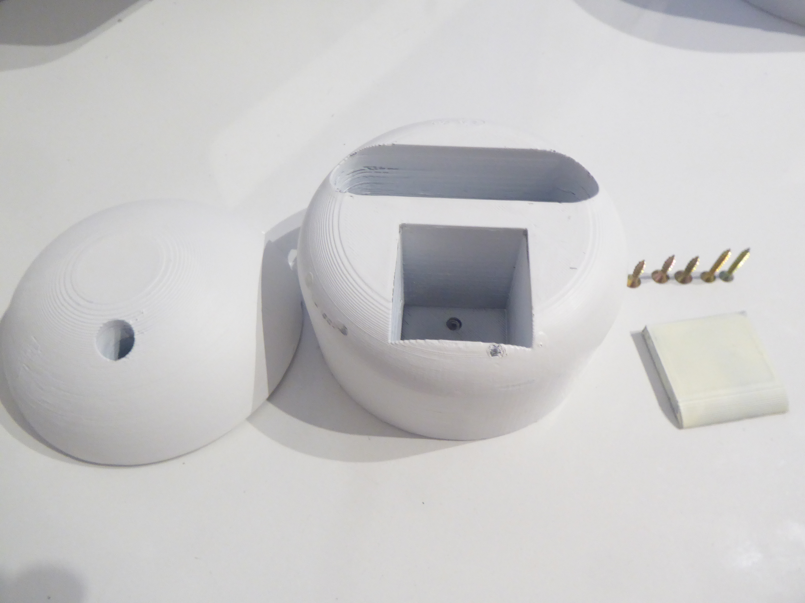

# Peter Moss COVID-19 AI Research Project
## EMAR Mini Emergency Assistance Robot
[](https://github.com/COVID-19-Research-Project/EMAR-Mini)

&nbsp;

# Table Of Contents

- [Introduction](#introduction)
- [DISCLAIMER](#disclaimer)
- [V1 Required Hardware](#v1-required-hardware)
- [Prerequisites](#prerequisites)
    - [HIAS Server](#hias-server)
    - [STLs For 3D Printing](#stls-for-3d-printing)
    - [Raspberry Pi OS Lite](#raspberry-pi-os-lite)
- [Installation](#installation)
  - [Device Security](#device-security)
    - [Remote User](#remote-user)
    - [SSH Access](#ssh-access)
    - [UFW Firewall](#ufw-firewall)
    - [Fail2Ban](#fail2ban)
  - [Python Dependencies](#python-dependencies)
  - [Create EMAR Device In HIAS](#create-emar-device-in-hias)
  - [Update Device Settings](#update-device-settings)
  - [Intel® Distribution of OpenVINO™ Toolkit](#intel-distribution-of-openvino-toolkit)
  - [Intel® RealSense™ D415](#intel-realsense-d415)
  - [Intel® Neural Compute Stick 2](#intel-neural-compute-stick-2)
  - [Connect the neck](#connect-the-neck)
  - [Assemble the head](#assemble-the-head)
  - [Connect the head to the neck](#connect-the-head-to-the-neck)
  - [Raspberry Pi 4 Stand](#raspberry-pi-4-stand)
  - [Raspberry Pi 4 Pinout](#raspberry-pi-4-pinout)
  - [Breadboard](#breadboard)
  - [Add the Intel® Neural Compute Stick 2](#add-the-intel-neural-compute-stick-2)
  - [Attach Raspberry Pi 4 Stand to EMAR Mini](#attach-raspberry-pi-4-stand-to-emar-mini)
  - [Connect the arm section](#connect-the-arm-sections)
  - [Connect servo wires to breadboard](#connect-servo-wires-to-breadboard)
  - [Connect servo wires to breadboard](#connect-servo-wires-to-breadboard)
  - [Install the breadboard](#install-the-breadboard)
  - [Install the Realsense camera](#install-the-realsense-camera)
  - [Finishing Up](#finishing-up)
- [Continue](#continue)
  
- [Contributing](#contributing)
    - [Contributors](#contributors)
- [Versioning](#versioning)
- [License](#license)
- [Bugs/Issues](#bugs-issues)

&nbsp;

# Introduction
The following guide will take you through setting up and installing [EMAR Mini Emergency Assistance Robot](https://github.com/COVID-19-Research-Project/EMAR-Mini "EMAR Mini Emergency Assistance Robot"). 

The Raspberry Pi 4 homes the EMAR Mini software and powers the Intel hardware.

&nbsp;

# DISCLAIMER

You should always be very careful when working with electronics! We will not accept responsibility for any damages done to hardware or yourself through full or partial use of this tutorial. Use this tutorial at your own risk, and take measures to ensure your own safety.

&nbsp;

# V1 Required Hardware

- 1 x Raspberry Pi 4
- 1 x Intel® RealSense™ D415
- 1 x Intel® Neural Compute Stick 2
- 1 x Breadboard
- 4 x Tower Pro SG90 Servos
- Jumper wires

&nbsp;

# Prerequisites  

## HIAS Sever
This system requires a fully functioning [HIAS server](https://github.com/LeukemiaAiResearch/HIAS "HIAS server"). Follow the [HIAS server installation guide](https://github.com/LeukemiaAiResearch/HIAS/blob/master/Documentation/Installation/Installation.md "HIAS server installation guide") to setup your HIAS server before continuing with this tutorial.

## STLs For 3D Printing

For this tutorial you will need to have already printed your EMAR Mini. Follow the [STLs For 3D Printing](../../STLs " STLs For 3D Printing") guide to complete the 3D printing part of this project.

## Raspberry Pi OS Lite

In this tutorial we will use Raspberry Pi OS Lite (Buster). First of all download the image from the [Raspberry Pi OS download page](https://www.raspberrypi.org/downloads/raspberry-pi-os/ " Raspberry Pi OS download page"), extract the image file, and write it to an SDK card. In our project we have used a 64GB SD card. 

Once you have done this, insert it in your Raspberry Pi 4, when you have logged in, use the following command to update your device and then open the Raspberry Pi configuration application. You need to expand your filesystem, setup your keyboard preferences and connect your RPI4 to your network.

```
sudo apt-get update && sudo apt-get upgrade
sudo raspi-config
```

&nbsp;

# Installation
Now you need to install the EMAR Mini hardware, software and dependencies.

## Device Security
First you will harden your device security. 

### Remote User
You will create a new user for accessing your server remotely. Use the following commands to set up a new user for your machine. Follow the instructions provided and make sure you use a secure password.
```
sudo adduser YourUsername 
```
Now grant sudo priveleges to the user:
```
usermod -aG sudo YourUsername
```
Now open a new terminal and login to your server using the new credentials you set up.
```
ssh YourNewUser@YourServerIP
```

### SSH Access
Now let's beef up server secuirty. Use the following command to set up your public and private keys. Make sure you carry out this step on your development machine, **not** on your server.

#### Tips
- Hit enter to confirm the default file. 
- Hit enter twice to skip the password (Optionalm, you can use a password if you like).
```
ssh-keygen
```
You should end up with a screen like this:
```
Generating public/private rsa key pair.
Enter file in which to save the key (/home/genisys/.ssh/id_rsa): 
Enter passphrase (empty for no passphrase): 
Enter same passphrase again: 
Your identification has been saved in /home/genisys/.ssh/id_rsa.
Your public key has been saved in /home/genisys/.ssh/id_rsa.pub.
The key fingerprint is:
SHA256:5BYJMomxATmanduT3/d1CPKaFm+pGEIqpJJ5Z3zXCPM genisys@genisyslprt
The key's randomart image is:
+---[RSA 2048]----+
|.oooo..          |
|o .o.o . .       |
|.+..    +        |
|o o    o .       |
|  .o .+ S . .    |
| =..+o = o.o . . |
|= o =oo.E .o..o .|
|.. + ..o.ooo+. . |
|        .o++.    |
+----[SHA256]-----+
```
Now you are going to copy your key to the server: 
```
ssh-copy-id YourNewUser@YourServerIP
```
Once you enter your password for the new user account, your key will be saved on the server. Now try and login to the server again in a new terminal, you should log straight in without having to enter a password.
```
ssh YourNewUser@YourServerIP
```
Finally you will turn off password authentication for login. Use the following command to edit the ssh configuration.
```
sudo nano /etc/ssh/sshd_config
```
Change the following:
```
#PasswordAuthentication yes
```
To:
```
PasswordAuthentication no
```
Then restart ssh:
```
sudo systemctl restart ssh
```
_If you are using ssh to do the above steps keep your current terminal connected._ Open a new terminal, attempt to login to your server. If you can login then the above steps were successful. 

The remainder of this tutorial assumes you are logged into your device. From your development machine, connect to your device using ssh or open your local terminal if working directly on the machine.

```
ssh YourUser@YourServerIP
```
### UFW Firewall
Now you will set up your firewall:

```
sudo ufw enable
sudo ufw disable
```
Now open the required ports, these ports will be open on your server, but are not open to the outside world:
```
sudo ufw allow 22
sudo ufw allow OpenSSH
```
Finally start and check the status:
```
sudo ufw enable
sudo ufw status
```
You should see the following:
```
Status: active

To                         Action      From
--                         ------      ----
OpenSSH                    ALLOW       Anywhere
22                         ALLOW       Anywhere
OpenSSH (v6)               ALLOW       Anywhere (v6)
22 (v6)                    ALLOW       Anywhere (v6)
```

### Fail2Ban
Fail2Ban adds an additional layer of security, by scanning server logs and looking for unusal activity. Fail2Ban is configured to work with IPTables by default, so we will do some reconfiguration to make it work with our firewall, UFW.

```
sudo apt install fail2ban
sudo mv /etc/fail2ban/jail.conf /etc/fail2ban/jail.local
sudo rm /etc/fail2ban/action.d/ufw.conf
sudo touch /etc/fail2ban/action.d/ufw.conf
echo "[Definition]" | sudo tee -a /etc/fail2ban/action.d/ufw.conf
echo "  enabled  = true" | sudo tee -a /etc/fail2ban/action.d/ufw.conf
echo "  actionstart =" | sudo tee -a /etc/fail2ban/action.d/ufw.conf
echo "  actionstop =" | sudo tee -a /etc/fail2ban/action.d/ufw.conf
echo "  actioncheck =" | sudo tee -a /etc/fail2ban/action.d/ufw.conf
echo "  actionban = ufw insert 1 deny from <ip> to any" | sudo tee -a /etc/fail2ban/action.d/ufw.conf
echo "  actionunban = ufw delete deny from <ip> to any" | sudo tee -a /etc/fail2ban/action.d/ufw.conf
sudo nano /etc/fail2ban/action.d/ufw.conf
sudo sed -i -- "s#banaction = iptables-multiport#banaction = ufw#g" /etc/fail2ban/jail.local
sudo nano /etc/fail2ban/jail.local
sudo fail2ban-client restart
sudo fail2ban-client status
```
You should see the following:
```
Shutdown successful
Server ready
```
```
Status
|- Number of jail:      1
`- Jail list:   sshd
```

## Python Dependencies

```
sudo apt install python3-pip
sudo pip3 install geolocation
sudo pip3 install paho-mqtt
sudo pip3 install psutil
sudo pip3 install numpy
sudo pip3 install requests
sudo pip3 install zmq
```

## Create EMAR Device In HIAS


Head to your HIAS Server and navigate to **Robotics->EMAR->Create**. In the **Device** settings, select your desired iotJumpWay Location and Zone, a name for your EMAR device, the IP and MAC address of your Raspberry Pi. The **Real-Time Object Detection & Depth** settings can be left with the default settings. If you modify the ports and the directory name you need to change these when updating the **HIAS Server Proxy** settings below. 

## HIAS Server Proxy

You need to update the HIAS Server Proxy settings so that the __proxy_pass__ can correctly redirect traffic to your Raspberry Pi.

To do this you need to edit the NGINX configuration. Use the following command on your HIAS server to edit the file with Nano:

```
sudo nano /etc/nginx/sites-available/default
```

Towards the top of the file you will find the settings that control the proxy for EMAR/EMAR Mini. You need to change **###.###.#.##** to the IP address of your Raspberry Pi.

If you changed the Stream Port, Stream Directory or Socket Port settings in the HIAS EMAR UI, you need to update these here also. 

```
location ~* ^/Robotics/EMAR/Live/(.*)$ {
        auth_basic "Restricted";
        auth_basic_user_file /etc/nginx/tass/htpasswd;
        proxy_pass http://###.###.#.##:8282/$1;
}
```

Once you have saved and exited the configuration, you need to reload the NGINX server:

```
sudo systemctl reload nginx
```

## Update Device Settings

Now you need to update the device settings using the credentials provided in the HIAS UI. If you changed the Stream Port and Socket Port settings you should also update them in this configuration file.

```
sudo nano confs.json
```
```
{
    "iotJumpWay": {
        "host": "",
        "port": 8883,
        "ip": "localhost",
        "lid": 0,
        "zid": 0,
        "did": 0,
        "dn": "",
        "un": "",
        "pw": ""
    },
    "EMAR": {
        "ip": ""
    },
    "Realsense": {
        "server": {
            "port": 8282
        },
        "socket": {
            "port": 8383
        }
    },
    "MobileNetSSD": {
        "bin": "Model/MobileNetSSD_deploy.bin",
        "classes": [
            "background",
            "aeroplane",
            "bicycle",
            "bird",
            "boat",
            "bottle",
            "bus",
            "car",
            "cat",
            "chair",
            "cow",
            "diningtable",
            "dog",
            "horse",
            "motorbike",
            "person",
            "pottedplant",
            "sheep",
            "sofa",
            "train",
            "tvmonitor"
        ],
        "inScaleFactor": 0.007843,
        "meanVal": 127.53,
        "size": 300,
        "threshold": 0.6,
        "xml": "Model/MobileNetSSD_deploy.xml"
    }
}
```

## Intel® RealSense™ D415


Now we will install the software for the Intel® RealSense™ D415.

**MAKE SURE YOUR REALSENSE IS NOT PLUGGED IN**

After unsuccessfully following a number of Intel's tutorials to install Realsense on a Raspberry Pi 3 and Raspberry Pi 4 and multiple OS, I was finally pointed in the direction of the [LibUVC-backend installation](https://github.com/IntelRealSense/librealsense/blob/master/doc/libuvc_installation.md "LibUVC-backend installation"). To make this work for our project, you need to modify the downloaded **libuvc_installation.sh** file and carry out an extra step. 

As per the guide, download the file first with:

```
wget https://github.com/IntelRealSense/librealsense/raw/master/scripts/libuvc_installation.sh
```

Then modify:

```
cmake ../ -DFORCE_LIBUVC=true -DCMAKE_BUILD_TYPE=release
```

To:

```
cmake ../ -DFORCE_LIBUVC=true -DCMAKE_BUILD_TYPE=release DBUILD_PYTHON_BINDINGS=bool:true
```

This will install the Python bindings we need to run **PyRealsense**. Now continue with:

```
chmod +x ./libuvc_installation.sh
./libuvc_installation.sh
```

And finally open your **bashrc** file

```
sudo nano ~/.bashrc
```

And add the following to the end of the file before saving and closing. 

```
export PYTHONPATH=$PYTHONPATH:/usr/local/lib
```

You can now plug in your Realsense to the Raspberry Pi and test by using the following to check if your device is recognized and opens successfully:

```
rs-enumerate-devices
```

And finally the following to test that PyRealsense is working:

```
python3
import pyrealsense
exit()
```

If you don't get any errors from **import pyrealsense**, everything is setup correctly for your Realsense.

## Intel® Distribution of OpenVINO™ Toolkit

Again the official Intel tutorials failed in one way or another, I finally came across a very good tutorial on [PyImageSearch](https://www.pyimagesearch.com/2019/04/08/openvino-opencv-and-movidius-ncs-on-the-raspberry-pi/ "PyImageSearch"). The following guide uses the parts relevant to our project and allows you to quickly setup OpenVINO on your Raspberry 4.

```
sudo apt-get install build-essential cmake unzip pkg-config
sudo apt-get install libjpeg-dev libpng-dev libtiff-dev
sudo apt-get install libavcodec-dev libavformat-dev libswscale-dev libv4l-dev
sudo apt-get install libxvidcore-dev libx264-dev
sudo apt-get install libgtk-3-dev
sudo apt-get install libcanberra-gtk*
sudo apt-get install libatlas-base-dev gfortran
sudo apt-get install python3-dev
cd
wget https://download.01.org/opencv/2020/openvinotoolkit/2020.1/l_openvino_toolkit_runtime_raspbian_p_2020.1.023.tgz
tar -xf l_openvino_toolkit_runtime_raspbian_p_2020.1.023.tgz
mv l_openvino_toolkit_runtime_raspbian_p_2020.1.023 openvino
nano ~/.bashrc
```

Now add the following line to the bottom of your bashrc file before saving and closing.

```
source ~/openvino/bin/setupvars.sh
```

## Intel® Neural Compute Stick 2

Again we use instructions provided in the [PyImageSearch](https://www.pyimagesearch.com/2019/04/08/openvino-opencv-and-movidius-ncs-on-the-raspberry-pi/ "PyImageSearch") tutorial to install NCS2 on the Raspberry Pi.

```
sudo usermod -a -G users "$(whoami)"
cd
sh openvino/install_dependencies/install_NCS_udev_rules.sh
```

## Connect the neck


First of all, push your final servo through the top of **Body-Middle.stl** and screw it in place. Next screw the servo arm to the bottom of the neck and attach to the servo. You may need some glue to keep this part secure.

## Assemble the head


Next let's assemble the head, **Face.stl**, **Head-Back.stl**  and **Camera-Cover.stl**. In the face you will see 3 holes. Use these holes to screw the face onto the back of the head, then place the camera cover over the large sqaure hole on the face.


## Connect the head to the neck


Now you need to use the two screws on the side of the neck to attach the head. Start off by screwing the screws just enough that they are coming through the other side, then place the head inside the neck and continue with screwing until the head is attached. 

## Raspberry Pi 4 Stand


Now we will set up your Raspberry Pi 4 stand that keep the Raspberry Pi in an upright position inside EMAR Mini. 

The related files are **RPI4-Base.stl** and **RPI4-Stand.stl**. First of all slide the stand into the base.


Now screw your Raspberry Pi 4 onto the stand with the ports facing the top.


## Raspberry Pi 4 Pinout

[Source](https://www.raspberrypi.org/documentation/usage/gpio/ "Source") 

## Breadboard


We will use a breadboard for our circuit. The first step is to connect wires from the PWM pins of the Raspberry Pi 4. Using the Raspberry Pi pinout diagram, connect GPIO 18, 13 and 12 to the breadboard. 

The servo's PWM signal wire is orange, in the photo above we use orange male->male jumper wires to connect the PWM pins to the breadboard. 

Also add a red wire from the 5v power pin and a black wire from ground. but do not connect them yet. 

## Add the Intel® Neural Compute Stick 2


Now plug your Neural Compute Stick 2 to the top USB3 on your Raspberry Pi.

## Attach Raspberry Pi 4 Stand to EMAR Mini

On the bottom of **Body-Bottom.stl**, you will see two holes for the screws that will attach the Raspberry Pi 4 Stand to the inside of EMAR Mini. 


Start by screwing in the screws until they just come throug the other side, this will make it easier to screw in the stand. Then turn the body bottom on it's side and screw in the Raspberry Pi 4 stand. 


Turn the bottom the right way up and place the breadboard perched on the top of the body.

## Connect the arm sections


There are two sections to EMAR Mini's arm, **Arm-Section-1.stl** and **Arm-Section-2.stl**. 

Connect the second arm section to the first using one of your servos, and then connect the firt arm section to the body using a second servo, then feed the wires through the hole to the inside of the body. 

## Connect servo wires to breadboard


Now you will connect the three servos to the bread board. Turn the body on it's side and place it close to the bottom of the body so that the wires can reach the breadboard which you left perched on top. 

Next we use red male->male jumpers to connect the servo power wires to the power rail on the breadboard, and male->male brown wires to connect the servo ground wires to ground rail on the breadboard.

Now we will connect the PWM signal wires (orange) to the breadboard. You need to connect them in the following way.

- Head servo -> GPIO 18
- First arm section servo -> GPIO 12
- Secon arm section servo -> GPIO 13

Next connect the red power cable from the Raspberry Pi 4 to the power rail on the breadboard and then the ground cable to the ground rail. 

## Install the breadboard


Now you need to gently place the breadboard inside the body of EMAR, just infront of the Raspberry Pi at the bottom. It will be easier to do this if you life the body up as you are placing the breadboard inside.

## Install the Realsense camera
 

Next take the USB type C lead coming from the Realsense camera and place it through the hole at the back of the neck into the body, pull it through and connect it to the second USB3 port on the Raspberry Pi. 

## Finishing up


Now take plug the USB type C power cable into the Raspberry Pi, but do not plug into the mains just yet. 

Once you have done that you need to attach the middle body to the bottom body. Be very careful to make sure you do not pull any of your wires off the Raspberry Pi or the breadboard, and make sure that the USB cable from the Realsense is packed into the top of the body, not doing so could cause you to not be able to move the head.  

Finally push the Realsense camera into the hole in the front of the face and make sure it is secure. In this version there was a miscalculation with the dimensions of the head, it is possible to wedge the camera into the head, but we are working on a larger head design for V2. Make sure the camera is securely wedged into the head before using.

# Continue

Now you can continue back to the [RPI4](../../RPI4 "RPI4") tutorial to complete setup.

&nbsp;

# Contributing

The Peter Moss Acute COVID-19 AI Research project encourages and welcomes code contributions, bug fixes and enhancements from the Github.

Please read the [CONTRIBUTING](../../../CONTRIBUTING.md "CONTRIBUTING") document for a full guide to forking your repositories and submitting your pull requests. You will also find information about your code of conduct on this page.

## Contributors

- [Adam Milton-Barker](https://www.leukemiaresearchassociation.ai/team/adam-milton-barker "Adam Milton-Barker") - [Asociacion De Investigation En Inteligencia Artificial Para La Leucemia Peter Moss](https://www.leukemiaresearchassociation.ai "Asociacion De Investigation En Inteligencia Artificial Para La Leucemia Peter Moss") President & Lead Developer, Sabadell, Spain

- [Jose Mario Garza](https://www.leukemiaresearchassociation.ai/team/jose-mario-garza "Jose Mario Garza") - [Asociacion De Investigation En Inteligencia Artificial Para La Leucemia Peter Moss](https://www.leukemiaresearchassociation.ai "Asociacion De Investigation En Inteligencia Artificial Para La Leucemia Peter Moss") 3D Designer/Printer, Mexico

&nbsp;

# Versioning

You use SemVer for versioning. For the versions available, see [Releases](../../../releases "Releases").

&nbsp;

# License

This project is licensed under the **MIT License** - see the [LICENSE](../../../LICENSE "LICENSE") file for details.

&nbsp;

# Bugs/Issues

You use the [repo issues](../../../issues "repo issues") to track bugs and general requests related to using this project. See [CONTRIBUTING](../../../CONTRIBUTING.md "CONTRIBUTING") for more info on how to submit bugs, feature requests and proposals.