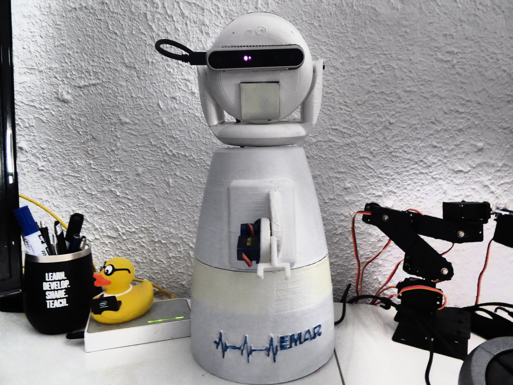

# Peter Moss COVID-19 AI Research Project
## EMAR Mini Emergency Assistance Robot
### Raspberry Pi 4
[](https://github.com/COVID-19-AI-Research-Project/EMAR-Mini)

&nbsp; 

# Table Of Contents

- [Introduction](#introduction)
- [Installation](#installation)
- [Start The Software](#start-the-software)
- [HIAS EMAR UI](#hias-emar-ui)
- [To Be Continued](#to-be-continued)
- [Contributing](#contributing)
    - [Contributors](#contributors)
- [Versioning](#versioning)
- [License](#license)
- [Bugs/Issues](#bugs-issues)

&nbsp;

# Introduction


The Raspberry Pi 4 homes the EMAR Mini software and powers the Intel hardware. This guide will provide a link to the installation guide and steps to get your EMAR Mini up and running using the HIAS Server UI. 

__This project is a work in progress, we are in the process of completing for full functionality of EMAR Mini.__

&nbsp;

# Installation

Please follow the [Installation Guide](Documentation/Installation.md) to install the EMAR Mini software and hardware.

&nbsp;

# Start The Software

You now need to start the EMAR Mini software. On your Raspberry Pi navigate to your project root and issue the following command:

```
python3 EMAR.py
```

EMAR Mini will connect to your HIAS iotJumpWay broker, and start the Realsense stream and classifier.

# HIAS EMAR UI


Now head to your HIAS Server and navigate to **Robotics->EMAR->List**, select your EMAR device and you should see your camera stream and the controls for EMAR Mini.

Available controls in this version of EMAR Mini are as follows:

- Head
  - LEFT
  - CENTER
  - RIGHT

  As you pan the head, you should see your camera stream moving in near real-time in the HIAS Server EMAR UI.

- Arm 
  - Arm section 1 UP
  - Arm section 1 DOWN
  - Arm section 2 UP
  - Arm section 2 DOWN

  In the **Arm** section, the double arrows represent arm section 1 and the single arrows represent arm section 2.

These actions should happen in near real-time, even if the controller is on the other side of the world. 

The object detection will detect any of the objects from the list in the project configuration, and will calculate the distance from EMAR Mini using the depth readings from the Intel Realsense. 

# To Be Continued



We are working on modifications to the 3D printed files and the additional functionality such as head tilt and wheels. Keep an eye on our page for updates to this repository.


&nbsp;

# Contributing

The Peter Moss Acute COVID-19 AI Research project encourages and welcomes code contributions, bug fixes and enhancements from the Github.

Please read the [CONTRIBUTING](../../CONTRIBUTING.md "CONTRIBUTING") document for a full guide to forking your repositories and submitting your pull requests. You will also find information about your code of conduct on this page.

## Contributors

- [Adam Milton-Barker](https://www.leukemiaresearchassociation.ai/team/adam-milton-barker "Adam Milton-Barker") - [Asociacion De Investigation En Inteligencia Artificial Para La Leucemia Peter Moss](https://www.leukemiaresearchassociation.ai "Asociacion De Investigation En Inteligencia Artificial Para La Leucemia Peter Moss") President & Lead Developer, Sabadell, Spain

- [Jose Mario Garza](https://www.leukemiaresearchassociation.ai/team/jose-mario-garza "Jose Mario Garza") - [Asociacion De Investigation En Inteligencia Artificial Para La Leucemia Peter Moss](https://www.leukemiaresearchassociation.ai "Asociacion De Investigation En Inteligencia Artificial Para La Leucemia Peter Moss") 3D Designer/Printer, Mexico

&nbsp;

# Versioning

We use SemVer for versioning. For the versions available, see [Releases](../../releases "Releases").

&nbsp;

# License

This project is licensed under the **MIT License** - see the [LICENSE](../../LICENSE "LICENSE") file for details.

&nbsp;

# Bugs/Issues

We use the [repo issues](../../issues "repo issues") to track bugs and general requests related to using this project. See [CONTRIBUTING](../../CONTRIBUTING.md "CONTRIBUTING") for more info on how to submit bugs, feature requests and proposals.