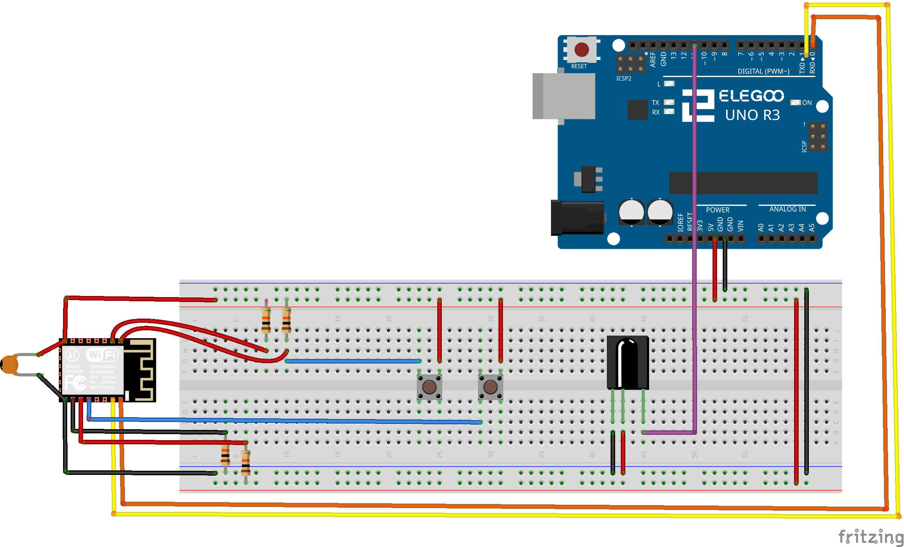
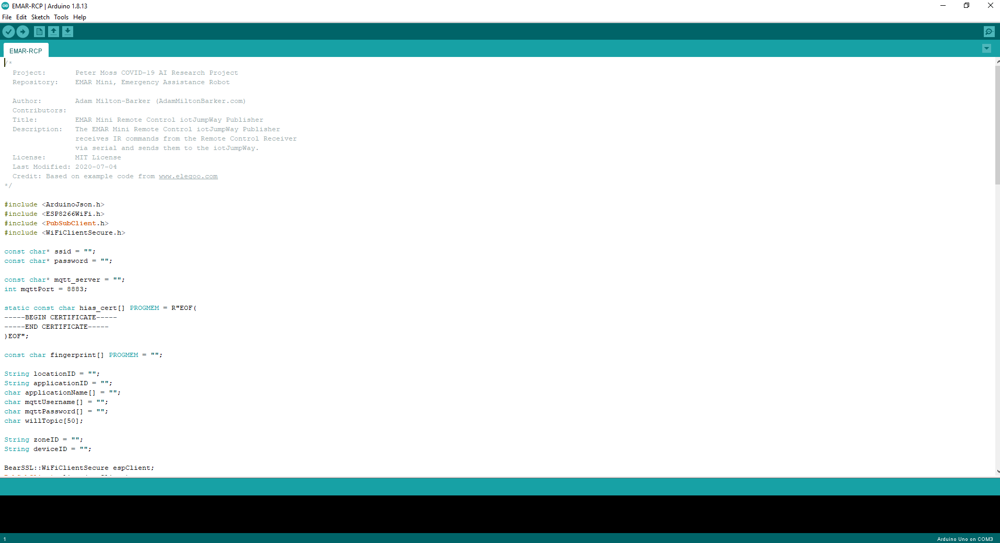
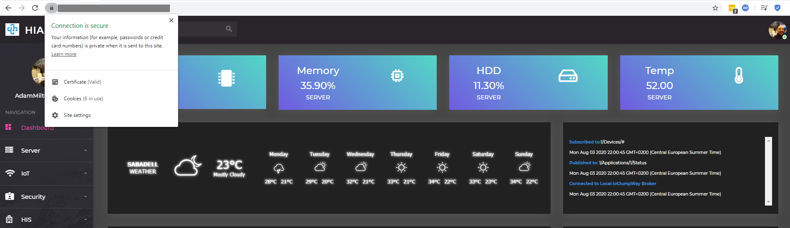
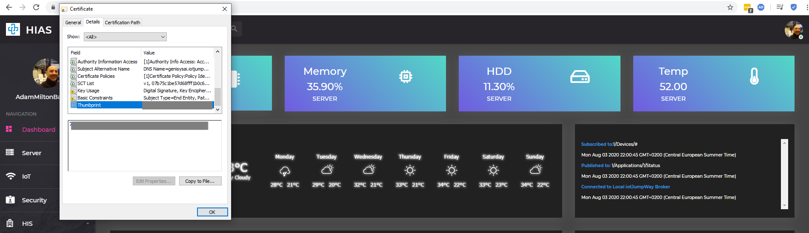
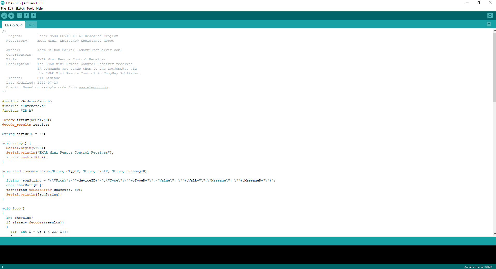

# Peter Moss COVID-19 AI Research Project
## EMAR Mini Emergency Assistance Robot
[](https://github.com/COVID-19-Research-Project/EMAR-Mini)

&nbsp;

# Table Of Contents

- [Introduction](#introduction)
- [DISCLAIMER](#disclaimer)
- [V1 Required Hardware](#v1-required-hardware)
- [Prerequisites](#prerequisites)
    - [STLs For 3D Printing Tutorial](#stls-for-3d-printing-tutorial)
    - [Raspberry Pi 4 Tutorial](#raspberry-pi-4-tutorial)
    - [ELEGOO UNO R3 & Breadboard](#elegoo-uno-r3--breadboard)
    - [EMAR-RCR](#emar-rcr)
    - [EMAR-RCP](#emar-rcp)
- [Installation](#installation)
    - [ESP8266 12F](#esp8266-12f)
- [Continue](#continue)
- [Contributing](#contributing)
    - [Contributors](#contributors)
- [Versioning](#versioning)
- [License](#license)
- [Bugs/Issues](#bugs-issues)

&nbsp;

# Introduction
The following guide will take you through setting up and installing [EMAR Mini Emergency Assistance Robot](https://github.com/COVID-19-Research-Project/EMAR-Mini "EMAR Mini Emergency Assistance Robot"). 

The Raspberry Pi 4 homes the EMAR Mini software and powers the Intel hardware.

&nbsp;

# DISCLAIMER

You should always be very careful when working with electronics! We will not accept responsibility for any damages done to hardware or yourself through full or partial use of this tutorial. Use this tutorial at your own risk, and take measures to ensure your own safety.

&nbsp;

# V1 Required Hardware

- 1 x ELEGOO UNO R3 Remote Control 
- 1 x ELEGOO IR Receiver Module
- 1 x Breadboard
- 1 x ESP8266
- 1 x USB to serial TTL UART Module
- 2 x Push Buttons
- 1 x 100Uf Ceramic Capacitor
- 5 x 10k Resistors
- 1 x Soldering Iron
- Solder
- Jumper wires

&nbsp;

# Prerequisites

Before you can complete this tutorial there are some prerequisites.

## STLs For 3D Printing Tutorial

You need to have completed the [STLs For 3D Printing](../../STLs "STLs For 3D Printing") tutorial and printed the EMAR Mini parts. 

## Raspberry Pi 4 Tutorial

You need to have completed the [Raspberry Pi 4](../../RPI4 "Raspberry Pi 4") tutorial and setup your EMAR Mini.

&nbsp;

# Installation
Now you will create your EMAR Mini Remote Control.

## ESP8266 12F


First we will start with the ESP8266 12F. To start, heat up your soldering iron. Next you need to solder wires to the following pins:

- TXD0
- RXD0
- GPIO0
- GPIO2
- GPIO15
- GND
- VCC 
- RST
- EN

In addition you need to solder the capacitor bridging between GND & VCC.

You are now ready to move on to setting up your ELEGOO UNO R3 and breadboard.

## ELEGOO UNO R3 & Breadboard


Follow the breadboard diagram above to set up your circuit. Here we are powering the ESP8266 directly from the 5V out of the ELEGOO UNO. As we are using the ESP8266, battery operation will not be possible as it will drain very quickly. You will need to plug your ELEGOO UNO into the mains using a suitable power adapter.

**WARNING: Many will advise not to power ESP8266 with 5V, however in my experience it is the only way that ESP8266 will work correctly with SSL. It is advised that the ESP8266 is not designed to run at 5V, however running at 3V you will more than likely not be able to make this project work. In all the years I have been using ESP8266, I have never had an issue with a single chip powering it with 5V. You should use 5V at your own discression**

The ESP8266 is used for WiFi communication, it connects to the iotJumpWay and waits for activity from the IR sensor, when it receives commands it sends via the iotJumpWay to EMAR Mini which allows you to control the robot using the remote control.


## iotJumpWay Credentials

Now we are going to set up the iotJumpWay Application. Head over to the HIAS UI and navigate to **IoT->Applications->Create**. Fill out the required information and click **Submit**. You will be taken to the newly created application page and will be able to access the application credentials.

## EMAR-RCP


EMAR-RCP is the publisher that sends the commands to EMAR Mini via the iotJumpWay.

To begin with you need to flash the [EMAR-RCP](../EMAR-RCP/EMAR-RCP.ino "EMAR-RCP") software to the ESP8266. You will need to make sure your Arduino enviornment is set up for [ESP8266 dev](https://arduino-esp8266.readthedocs.io/en/latest/installing.html) before you continue.

In the [EMAR-RCP](../EMAR-RCP/EMAR-RCP.ino "EMAR-RCP") file, you need to need to add your SSL certificate fingerprint, your WiFi details and iotJumpWay Application credentials. 

To get your SSL certifcate fingerprint, you should click on the padlock in the browser window when you are on the HIAS UI 


Then click **Certificate**. This will open up a window with details about your certificate.


Now click on **Details** and scroll down until you see **Thumbprint**. Click on Thumbprint and your certificate thumbprint will be displayed in the window. You should copy this thumbprint and paste it into the **fingerprint[]** setting at the top of the file (See below).

Now add your SSID and WiFi password to the settings, the URL of your HIAS server, and the iotJumpWay Application details. For the Zone and Device IDs you should use the Zone and Device ID of EMAR Mini.

```
const char fingerprint[] PROGMEM = "";

const char* ssid = "";
const char* password = "";

const char* mqtt_server = "";
int mqttPort = 8883;

String locationID = "";
String applicationID = "";
char applicationName[] = ""; 
char mqttUsername[] = ""; 
char mqttPassword[] = ""; 
char willTopic[50];

String zoneID = "";
String deviceID = "";
```
Using your chosen USB to serial TTL UART Module and the breadboard, connect RX of the serial module to the TX of the ESP8266, next connect the TX of your serial module to the RX of ESP8266 and connect the power and ground cables (Make sure you move the UNO -> ESP8266 serial connection first). 

Assuming you have the Arduino IDE set up, you can now flash the ESP8266. You will notice there are two push buttons. The one closest to the ESP8266 is for setting the ESP8266 into flash mode, the second button is for resetting the device. 

Press the upload button in Arduino IDE and straight away hold the flashing button down, after a couple of seconds push the reset button and then release both. You should see the blue LED start to flash, this means that the ESP8266 is being flashed. 

Once it has finished, the ESP8266 is ready.

## EMAR-RCR
EMAR-RCR is the remote control receiver, it waits for commands sent from the remote control and sends them via serial to the RCP script running on the ESP8266.



To begin with you need to flash the software to the ELEGOO UNO R3. Connect your UNO R3 to your computer.

Next you need to add the EMAR Mini Device ID to the settings at the top of the file.

```
String deviceID = "";
```

Once you flash the software to the ELEGOO UNO, you are now ready to continue. 

# Continue

Now you can continue back to the [RPI4](../../RPI4 "RPI4") tutorial to complete setup.

&nbsp;

# Contributing

The Peter Moss Acute COVID-19 AI Research project encourages and welcomes code contributions, bug fixes and enhancements from the Github.

Please read the [CONTRIBUTING](../../../CONTRIBUTING.md "CONTRIBUTING") document for a full guide to forking your repositories and submitting your pull requests. You will also find information about your code of conduct on this page.

## Contributors

- [Adam Milton-Barker](https://www.leukemiaresearchassociation.ai/team/adam-milton-barker "Adam Milton-Barker") - [Asociacion De Investigation En Inteligencia Artificial Para La Leucemia Peter Moss](https://www.leukemiaresearchassociation.ai "Asociacion De Investigation En Inteligencia Artificial Para La Leucemia Peter Moss") President & Lead Developer, Sabadell, Spain

&nbsp;

# Versioning

You use SemVer for versioning. For the versions available, see [Releases](../../../releases "Releases").

&nbsp;

# License

This project is licensed under the **MIT License** - see the [LICENSE](../../../LICENSE "LICENSE") file for details.

&nbsp;

# Bugs/Issues

You use the [repo issues](../../../issues "repo issues") to track bugs and general requests related to using this project. See [CONTRIBUTING](../../../CONTRIBUTING.md "CONTRIBUTING") for more info on how to submit bugs, feature requests and proposals.