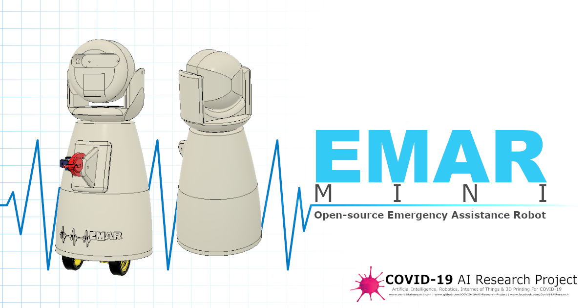

# Peter Moss COVID-19 AI Research Project
## EMAR Mini Emergency Assistance Robot
### ELEGOO UNO R3 Remote Control

&nbsp; 

# Table Of Contents

- [Introduction](#introduction)
- [Installation](#installation)
- [Start The Software](#start-the-software)
- [Use the remote control](#use-the-remote-control)
- [Contributing](#contributing)
    - [Contributors](#contributors)
- [Versioning](#versioning)
- [License](#license)
- [Bugs/Issues](#bugs-issues)

&nbsp;

# Introduction

 In this project we use the **ELEGOO UNO R3** with their **IR Receiver Module** and **Remote Control** from their [ELEGOO UNO Project Super Starter Kit](https://www.amazon.es/ELEGOO-Iniciaci%C3%B3n-Alimentaci%C3%B3n-Servomotor-Desarrollo/dp/B01MXGST4I "ELEGOO UNO Project Super Starter Kit") to provide real-time control of EMAR Mini. 

 **We would like to thank ELEGOO for sponsoring us with this kit. This will be one of the medical projects we are building that will use this kit.**

 For WiFi connectivity we use the ESP8266 12f and serial communication to receive the IR commands from the ELEGOO board.

&nbsp;

# Installation

Please follow the [Installation Guide](Documentation/Installation.md) to install the EMAR Mini software and hardware.

&nbsp;

# Use the remote control

Now you are all setup, just plug your ELEGOO UNO R3 board into the mains, make sure EMAR Mini is alive, point the remote at the IR sensor and use the following buttons to control EMAR Mini.

- Fast Forward (>>) = Pan head right
- Rewind (<<) - Pan head left
- Pause = Pan head to center

- 2 = Arm section 1 up
- 5 = Arm section 1 down
- Volume Up (^) = Arm section 2 up
- Volume Down = Arm section 2 down

These actions should happen in near real-time. 

# To Be Continued

We are working on modifications to the 3D printed files and the additional functionality such as head tilt and wheels. Keep an eye on our page for updates to this repository.

&nbsp;

# Contributing

The Peter Moss Acute COVID-19 AI Research project encourages and welcomes code contributions, bug fixes and enhancements from the Github.

Please read the [CONTRIBUTING](../../CONTRIBUTING.md "CONTRIBUTING") document for a full guide to forking your repositories and submitting your pull requests. You will also find information about your code of conduct on this page.

## Contributors

- [Adam Milton-Barker](https://www.leukemiaresearchassociation.ai/team/adam-milton-barker "Adam Milton-Barker") - [Asociacion De Investigation En Inteligencia Artificial Para La Leucemia Peter Moss](https://www.leukemiaresearchassociation.ai "Asociacion De Investigation En Inteligencia Artificial Para La Leucemia Peter Moss") President & Lead Developer, Sabadell, Spain

&nbsp;

# Versioning

We use SemVer for versioning. For the versions available, see [Releases](../../releases "Releases").

&nbsp;

# License

This project is licensed under the **MIT License** - see the [LICENSE](../../LICENSE "LICENSE") file for details.

&nbsp;

# Bugs/Issues

We use the [repo issues](../../issues "repo issues") to track bugs and general requests related to using this project. See [CONTRIBUTING](../../CONTRIBUTING.md "CONTRIBUTING") for more info on how to submit bugs, feature requests and proposals.