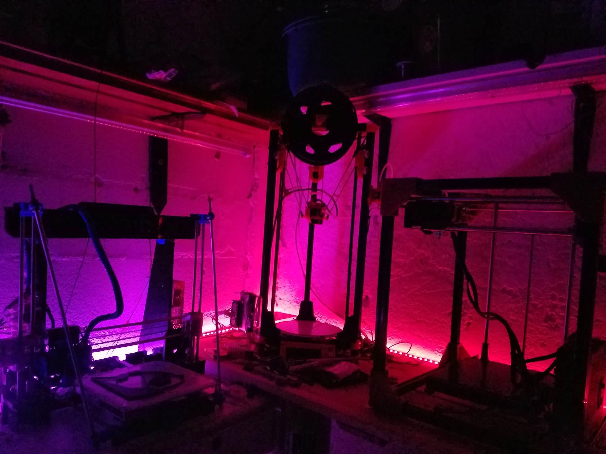

# Peter Moss COVID-19 AI Research Project
## EMAR Mini Emergency Assistance Robot
### STLs For 3D Printing
[](https://github.com/COVID-19-AI-Research-Project/EMAR-Mini)

&nbsp; 

# Table Of Contents

- [Introduction](#introduction)
- [Prerequisites](#prerequisites)
  - [Clone the repository](#clone-the-repository)
      - [Developer Forks](#developer-forks)
- [Start Printing](#start-printing)
- [Contributing](#contributing)
    - [Contributors](#contributors)
- [Versioning](#versioning)
- [License](#license)
- [Bugs/Issues](#bugs-issues)

&nbsp;

# Introduction



This tutorial will prepare you for printing your very on EMAR Mini V1. 
The STLs provided have been created by team member [Jose Mario Garza](https://www.leukemiaresearchassociation.ai/team/jose-mario-garza "Jose Mario Garza"), he also printed our version of EMAR Mini in his lab in Mexico.

__This project is a work in progress, we are in the process of modifying the STLs to allow for full functionality.__

&nbsp;

# Prerequisites

Before you can print your EMAR Mini V1, there are some prerequisites.

## Clone the repository

Clone the [EMAR-Mini](https://github.com/COVID-19-AI-Research-Project/EMAR-Mini " EMAR-Mini") repository from the [Peter Moss COVID-19 AI Research](https://github.com/COVID-19-AI-Research-Project "Peter Moss COVID-19 AI Research") Github Organization.

To clone the repository and install the COVID-19 Tensorflow DenseNet Classifier For Raspberry Pi 4, make sure you have Git installed. Now navigate to the home directory on your device using terminal/commandline, and then use the following command.

```
$ git clone https://github.com/COVID-19-AI-Research-Project/EMAR-Mini.git
```

Once you have used the command above you will see a directory called **EMAR-Mini** in your home directory.

```
ls
```

Using the ls command in your home directory should show you the following.

```
EMAR-Mini
```

Navigate to **COVID-19-AI-Research-Project/Projects/STLs** directory, this is your project root directory for this tutorial.

### Developer Forks

Developers from the Github community that would like to contribute to the development of this project should first create a fork, and clone that repository. For detailed information please view the [CONTRIBUTING](../../../../CONTRIBUTING.md "CONTRIBUTING") guide. You should pull the latest code from the development branch.

```
  $ git clone -b "0.5.0" https://github.com/COVID-19-AI-Research-Project/EMAR-Mini.git
```

The **-b "0.5.0"** parameter ensures you get the code from the latest master branch. Before using the below command please check our latest master branch in the button at the top of the project README.

&nbsp;

# Start Printing


Now it is time to start printing, simply start printing the files from the **Files** folder.


&nbsp;

# Contributing

The Peter Moss Acute COVID-19 AI Research project encourages and welcomes code contributions, bug fixes and enhancements from the Github.

Please read the [CONTRIBUTING](../../CONTRIBUTING.md "CONTRIBUTING") document for a full guide to forking your repositories and submitting your pull requests. You will also find information about your code of conduct on this page.

## Contributors

- [Jose Mario Garza](https://www.leukemiaresearchassociation.ai/team/jose-mario-garza "Jose Mario Garza") - [Asociacion De Investigation En Inteligencia Artificial Para La Leucemia Peter Moss](https://www.leukemiaresearchassociation.ai "Asociacion De Investigation En Inteligencia Artificial Para La Leucemia Peter Moss") 3D Designer/Printer, Mexico

&nbsp;

# Versioning

We use SemVer for versioning. For the versions available, see [Releases](../../releases "Releases").

&nbsp;

# License

This project is licensed under the **MIT License** - see the [LICENSE](../../LICENSE "LICENSE") file for details.

&nbsp;

# Bugs/Issues

We use the [repo issues](../../issues "repo issues") to track bugs and general requests related to using this project. See [CONTRIBUTING](../../CONTRIBUTING.md "CONTRIBUTING") for more info on how to submit bugs, feature requests and proposals.