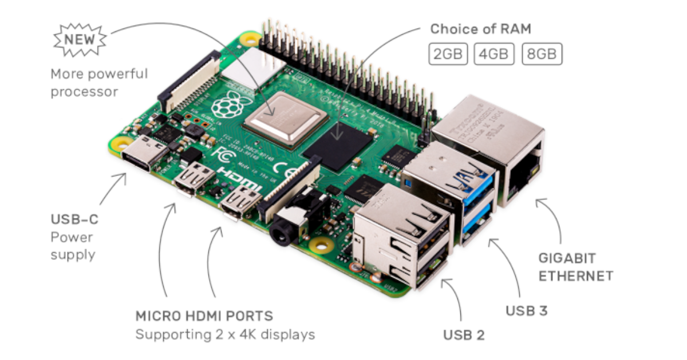
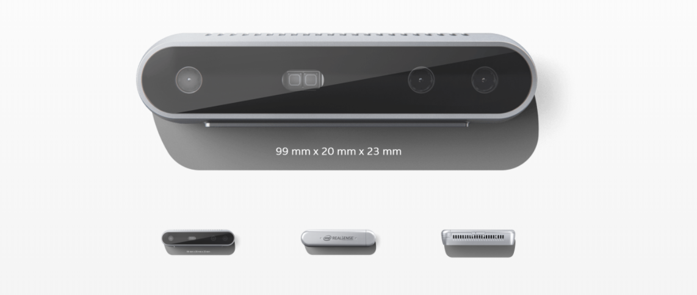
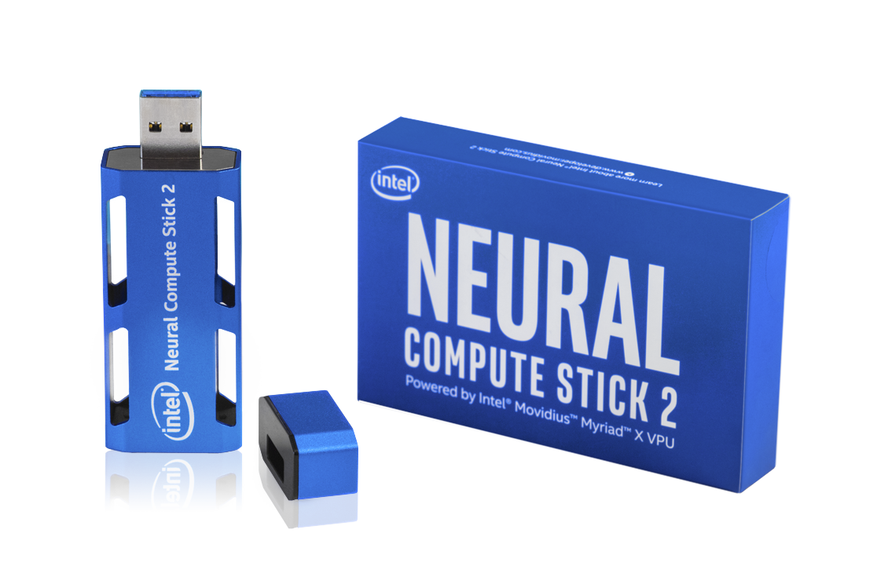

# Peter Moss COVID-19 AI Research Project
## EMAR Mini Emergency Assistance Robot

    

&nbsp; 

# Table Of Contents

- [Introduction](#introduction)
- [Open Technology](#open-technology)
- [Key Features](#key-features)
- [Available Features](#avialable-features)
- [About Raspberry Pi 4](#about-raspberry-pi-4)
- [About Intel® RealSense™ D415](#about-intel-realsense-d415)
- [About Intel® Neural Compute Stick 2](#about-intel-neural-compute-stick-2)
- [About ELEGOO UNO R3 Kit](#about-elegoo-uno-r3-kit)
- [About ESP8266 12F](#about-esp8266-12f)
- [Projects](#projects)
- [Contributing](#contributing)
    - [Contributors](#contributors)
- [Versioning](#versioning)
- [License](#license)
- [Bugs/Issues](#bugs-issues)

&nbsp;

# Introduction

**EMAR Mini** is a minature version of EMAR, an open-source Emergency Robot Assistant to assist doctors, nurses and hospital staff during the COVID-19 pandemic, and similar situations we may face in the future.

The idea for this open-source tele-operated robot came as I was sat in room in a hospital surrounded by people with COVID-19 as a potential COVID-19 Pneumonia patient. The doctors, nurses and other teams were in among us for the whole 12 hours or more I was in the hospital.

Some of the common things I saw was nurses & doctors calling patients, giving paracetamol, taking temperatures, adjusting masks and blankets. Every time one of the medical staff had to do one of these tasks they were putting themselves in danger of catching COVID-19.

Each of these tasks can be carried out by tele-operated robots, so this is where the idea for EMAR came from.   

EMAR Mini will be our official demonstration robot as it is smaller and more portable, though has obvious restrictions compared to EMAR. EMAR Mini does not have the full capabilities of EMAR.

__This project is a work in progress, however our plan is to work with a local medical/health center or hospital to do a pilot project with EMAR (Large).__

&nbsp;

# Open Technology
- **Open Software** 
    - EMAR Mini's software is entirely open-source.
- **Open STLS** 
    - The STL files required to print EMAR are open-source.

&nbsp;

# Key Features

Below are the features that will be available in the completed 

- **HIAS Network Device:** EMAR is a device on the HIAS network, allowing machine to machine/machine to application communication.

- **HIAS UI Plugin:** Integration with the HIAS UI.

- **3D printed:** EMAR's shell is 3D printed.

- **Tele-Operated:** Remotely operated using the HIAS UI, voice control & remote control.

- **Real-Time Depth Sensing:**  Uses Intel® RealSense™ D415 camera and streams depth frames to a local server, used by HIAS to allow users to see realtime stream of depth sensors.

- **Real-Time Camera Stream:** Uses Intel® RealSense™ D415 camera and streams camera frames to a local server.

- **Object Detection:** Uses Intel Neural Computer Stick 2 to provide object recognition on the Realsense D415 camera stream.

- **Remote Control:** Uses ELEGOO Uno R3 kit with their IR Receiver Module and Remote Control to provide easy remote control of EMAR Mini.

- **Real-Time 2 Way Audio Communication:** Audio is sent from HIAS and other applications to EMAR Mini and vice versa. This feature is to provide medical teams the ability to communicate with patients in real-time whilst seeing them via the real-time camera stream.

- **Thermal Sensing:** A thermal camera is used to take patient's temperatures safely.

&nbsp;

# Available Features

As mentioned the project is a work in progress. Below you will find the currently available features.

- V1 of the 3D printed files are now available.

- V1 of the HIAS EMAR/EMAR Mini UI is now available in the [HIAS server](https://github.com/LeukemiaAiResearch/HIAS "HIAS server") project. This system allows tele-operation of EMAR Mini and viewing the real-time streams.

- HIAS tele-operation for the following:
    - Panning the head.
    - Moving the two arm pieces.

- Real-time depth sensing and stream.

- Real-time camera stream, object detection and object distance measurements.

&nbsp;

# About Raspberry Pi 4

The [Rapsberry Pi 4](https://www.raspberrypi.org/products/raspberry-pi-4-model-b/ "Rapsberry Pi 4") is the latest model in the Raspberry Pi family. The new model is more energey efficient, provides Gigabit Ethernet/WiFi/Bluetooth and has USB3. You can choose from 2GB, 4GB, or 8GB ram depending on the requirements of your project. 

In this project we use the 2GB ram model and the [Rapsberry Pi OS (Buster)](https://www.raspberrypi.org/downloads/raspberry-pi-os/ "Rapsberry Pi OS (Buster)"). The RPI4 device homes all of the software required to run EMAR Mini.

&nbsp;

# About Intel® RealSense™ D415

The [Intel® RealSense™ D415](https://www.intelrealsense.com/depth-camera-d415/ "Intel® RealSense™ D415") has a standard field of view well suited for high accuracy applications such as 3D scanning. With a rolling shutter on the depth sensor, the D415 offers our highest depth quality per degree. 

In this project we use the D415 device to provide real-time depth and camera streams, as well as providing the depth measurements to allow distance measuring of objects seen by the camera.

&nbsp;

# About Intel® Neural Compute Stick 2

The [Intel® Neural Compute Stick 2](https://store.intelrealsense.com/buy-intel-neural-compute-stick-2.html "Intel® Neural Compute Stick 2") (NCS2) is a USB plug & play AI device for deep learning inference at the edge. The Intel® NCS2 is built on the Intel® Movidius™ Myriad™ X VPU featuring 16 programmable shave cores and a dedicated neural compute engine for hardware acceleration of deep neural network inferences. 

In this project we use the NCS2 device to provide real-time object detection on the D415 real-time camera stream.

&nbsp;

# About ELEGOO UNO R3 Kit

 The [ELEGOO UNO Project Super Starter Kit](https://www.amazon.es/ELEGOO-Iniciaci%C3%B3n-Alimentaci%C3%B3n-Servomotor-Desarrollo/dp/B01MXGST4I "ELEGOO UNO Project Super Starter Kit") is an IoT development kit that provides an **ELEGOO UNO R3** board which is compatible with Arduino IDE, and a range of IoT sensors and actuators for fast prototyping of IoT projects. 

 In this project we use the **IR Receiver Module** and **Remote Control** to provide real-time control of EMAR Mini. 

 **We would like to thank ELEGOO for sponsoring us with this kit. This will be one of the medical projects we are building that will use this kit.**

 # About ESP8266 12F

 The [ESP8266 12F](https://www.espressif.com/en/products/socs/esp8266/overview "ESP8266 12F") a 2016 chip from the ESP8266 family. The chip has 1 MiB of built-in flash, allowing the building of single-chip devices capable of connecting to Wi-Fi.

 We use the ESP8266 12F to connect the ELEGOO UNO R3 to the iotJumpWay allowing communication between the remote control and EMAR Mini. The ELEGOO UNO R3 communicates with the ESP8266 via serial communication which sends commands to EMAR Mini via the iotJumpWay

&nbsp;

## Projects

Below you will find all EMAR Mini projects, including the STLs for 3D printing, the Raspberry Pi 4 version, and the remote control.

**PLEASE NOTE: This project requires a functioning installation of the [HIAS server](https://github.com/LeukemiaAiResearch/HIAS "HIAS server"). Follow the [HIAS server installation guide](https://github.com/LeukemiaAiResearch/HIAS/blob/master/Documentation/Installation/Installation.md "HIAS server installation guide") before beginning these tutorials.**

| ID | GUIDE | INFORMATION | AUTHOR | Status |
| ----- | ----- | ----------- | ------ | ------ |
| 1 | [STLs For 3D Printing](Projects/STLs "STLs For 3D Printing") | V1 of the open-source 3D printed files for EMAR Mini. |  [Jose Mario Garza](https://www.leukemiaresearchassociation.ai/team/jose-mario-garza "Jose Mario Garza") | V1 Complete | 
| 2 | [Raspberry Pi 4](Projects/RPI4 "Raspberry Pi 4") | V1 of the Raspberry Pi 4 hardware and software setup required for EMAR Mini. |  [Adam Milton-Barker](https://www.leukemiaresearchassociation.ai.com/team/adam-milton-barker "Adam Milton-Barker") | V1 Complete | 
| 3 | [ELEGOO UNO R3 Remote Control](Projects/Remote-Control "ELEGOO UNO R3 Remote Control") | An IoT connected remote control that can control EMAR Mini. |  [Adam Milton-Barker](https://www.leukemiaresearchassociation.ai.com/team/adam-milton-barker "Adam Milton-Barker") | Complete | 

&nbsp;

# Contributing

The Peter Moss Acute COVID-19 AI Research project encourages and welcomes code contributions, bug fixes and enhancements from the Github.

Please read the [CONTRIBUTING](CONTRIBUTING.md "CONTRIBUTING") document for a full guide to forking your repositories and submitting your pull requests. You will also find information about your code of conduct on this page.

## Contributors

- [Adam Milton-Barker](https://www.leukemiaresearchassociation.ai/team/adam-milton-barker "Adam Milton-Barker") - [Asociacion De Investigation En Inteligencia Artificial Para La Leucemia Peter Moss](https://www.leukemiaresearchassociation.ai "Asociacion De Investigation En Inteligencia Artificial Para La Leucemia Peter Moss") President & Lead Developer, Sabadell, Spain

- [Jose Mario Garza](https://www.leukemiaresearchassociation.ai/team/jose-mario-garza "Jose Mario Garza") - [Asociacion De Investigation En Inteligencia Artificial Para La Leucemia Peter Moss](https://www.leukemiaresearchassociation.ai "Asociacion De Investigation En Inteligencia Artificial Para La Leucemia Peter Moss") 3D Designer/Printer, Mexico

&nbsp;

# Versioning

We use SemVer for versioning. For the versions available, see [Releases](releases "Releases").

&nbsp;

# License

This project is licensed under the **MIT License** - see the [LICENSE](LICENSE "LICENSE") file for details.

&nbsp;

# Bugs/Issues

We use the [repo issues](issues "repo issues") to track bugs and general requests related to using this project. See [CONTRIBUTING](CONTRIBUTING.md "CONTRIBUTING") for more info on how to submit bugs, feature requests and proposals.